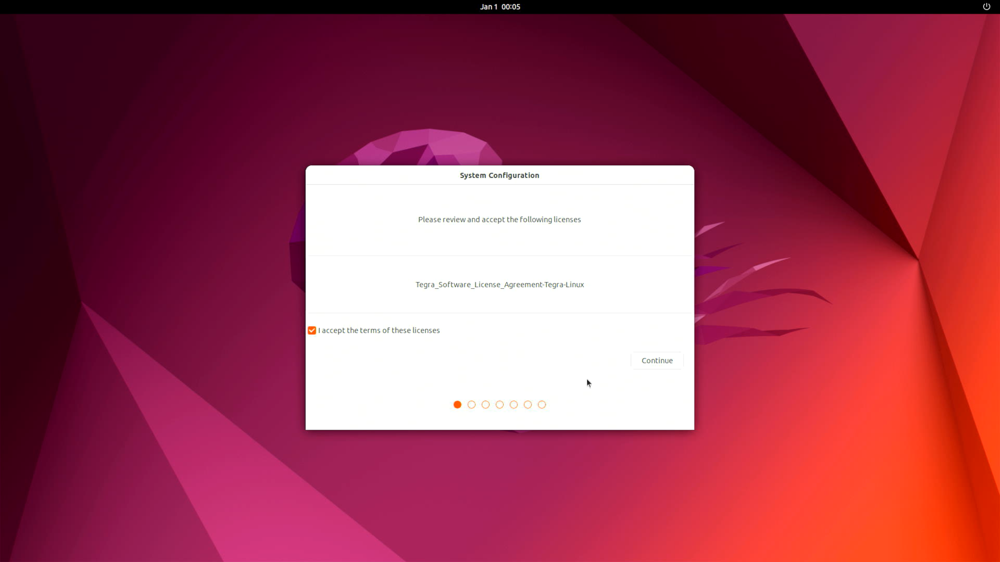

# Hardware Setup
This guide will walk you through how to assemble the hardware, and flash the OS onto the Jetson Orin Nano. This guide will be focused on the [Seed Studio J401 Carrier Board](https://www.seeedstudio.com/reComputer-J401-Carrier-Board-for-Jetson-Orin-NX-Orin-Nano-p-5636.html?srsltid=AfmBOooAkb-AXaLjTLzwR_bd8hEQg_XqoU2tUUa1oWQuXeJkGLJrSoZP).

## Flash Jetpack OS onto board (Original guide [here](https://wiki.seeedstudio.com/reComputer_J4012_Flash_Jetpack/))
You can feel free to follow the original guide, but the condensed steps for this specific setup, Jetpack 6.2 w/ the J401 are [here](https://wiki.seeedstudio.com/reComputer_J4012_Flash_Jetpack/).
1. To do this, you need a Ubuntu Host Computer running Ubuntu 22.04 since this is directly compatible with Jetpack 6.2, for this I set up my Windows computer to dual-boot into Ubuntu Jammy 22.04. There are many youtube videos on how to do this, here is [one](https://www.youtube.com/watch?v=mXyN1aJYefc&t=1s).
2. Here is a quick overview of what to do, but I will lay it out step by step after.
.
3. Connect a female to female jumper pin to force the device into forced recovery mode by connected the GND and FC Rec pins shown .
4. After you have set up dual boot on your host computer, boot into it.
5. Right click on your desktop, and click `Open in Terminal`, then run `lsusb`.

   Make sure this device ID (For Orin Nano 8GB: 0955:7523 NVidia Corp) shows up:

   

   If it shows up, it is properly connected.

6. You can now remove the recovery wire.
7. On your host computer in the terminal, install:
```bash
sudo apt install qemu-user-static sshpass abootimg nfs-kernel-server libxml2-utils binutils -y
```
8. Download this [flashing script](https://seeedstudio88-my.sharepoint.com/:u:/g/personal/youjiang_yu_seeedstudio88_onmicrosoft_com/EcyQPZeI9glGmENtN2a4A2oBizsgTMATEMEMZCPI06aWJg?e=ctPbmU).
9. This file should appear in your downloads, run these commmands:
```bash
cd ~/Downloads
sudo tar xpf mfi_xxxx.tar.gz
# For example: sudo tar xpf mfi_recomputer-orin-nano-8g-j401-6.2-36.4.3-2025-04-07.tar.gz
```
Now navigiate into the unpacked folder:
```bash
cd mfi_recomputer-orin-j401
sudo ./tools/kernel_flash/l4t_initrd_flash.sh --flash-only --massflash 1 --network usb0  --showlogs
```
Now you wait for this message, this script can vary from 2~10 minutes long.

10. Now you are done with the host computer, connect the J401 to a display using the HDMI connector on the board and finish the initial configuration setup, you should just be able to continue with all options 
11. Now the Jetson should be all set up!